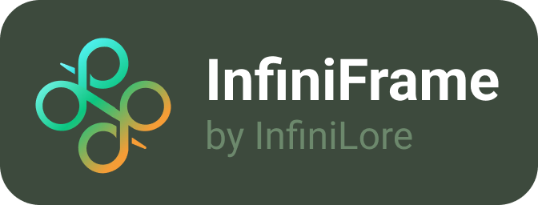

 

*A modern and cross-platform native window framework for .NET that lets you build desktop applications using web technologies — load any URL, render HTML strings, or embed a full Blazor application inside a native window*

Supports **Windows** (WebView2), **Linux** (WebKit2GTK), and **macOS** (WKWebView)

> **Note:** This project is a modern rework of  [Photino.Net](https://github.com/tryphotino/photino.NET), [Photino.Net.Server](https://github.com/tryphotino/photino.NET.Server), [Photino.Blazor](https://github.com/tryphotino/Photino.Blazor)
> and [Photino.Native](https://github.com/tryphotino/photino.Native) and is not affiliated with or endorsed by the original Photino authors

## Packages

| Package | Description |
|---------|-------------|
| [](https://www.nuget.org/packages/InfiniLore.InfiniFrame) | Core window builder and runtime |
| [](https://www.nuget.org/packages/InfiniLore.InfiniFrame.Shared) | Shared interfaces, types, enums, and delegates |
| [](https://www.nuget.org/packages/InfiniLore.InfiniFrame.Blazor) | Pre-built Blazor components for custom window chrome |
| [](https://www.nuget.org/packages/InfiniLore.InfiniFrame.BlazorWebView) | Full Blazor app integration inside a native window |
| [](https://www.nuget.org/packages/InfiniLore.InfiniFrame.WebServer) | ASP.NET Core web app running inside a native window |
| [](https://www.nuget.org/packages/InfiniLore.InfiniFrame.Js) | JavaScript and Blazor interop utilities |

## Quick Start

### Load a URL in a native window

Install: `dotnet add package InfiniLore.InfiniFrame`

```csharp
using InfiniFrame;

var window = InfiniFrameWindowBuilder.Create()
    .SetTitle("My App")
    .SetSize(1280, 720)
    .Center()
    .SetStartUrl("https://example.com")
    .Build();

window.WaitForClose();
```

### Embed a Blazor application

Install: `dotnet add package InfiniLore.InfiniFrame.BlazorWebView`

```csharp
using InfiniFrame.BlazorWebView;

var builder = InfiniFrameBlazorAppBuilder.CreateDefault(args, w => w
    .SetTitle("My Blazor App")
    .SetSize(1280, 720)
    .Center()
);

builder.RootComponents.Add<App>("#app");
builder.RootComponents.Add<HeadOutlet>("head::after");

builder.Build().Run();
```

### Host an ASP.NET Core web app

Install: `dotnet add package InfiniLore.InfiniFrame.WebServer`

```csharp
using InfiniFrame.WebServer;

var app = InfiniFrameWebApplication.CreateBuilder(args)
    .Build()
    .UseAutoServerClose();

app.Run();
```

## Architecture

```
Your Application
│
├── InfiniLore.InfiniFrame                ← Core: window builder & runtime
├── InfiniLore.InfiniFrame.BlazorWebView  ← Blazor app lifecycle
├── InfiniLore.InfiniFrame.WebServer      ← ASP.NET Core integration
│
├── InfiniLore.InfiniFrame.Blazor         ← Window chrome Razor components
├── InfiniLore.InfiniFrame.Js             ← JS/Blazor interop
│
└── InfiniLore.InfiniFrame.Shared         ← Interfaces, types, native interop
        └── InfiniFrame.Native (internal) ← C++ platform layer
```

Only one of `BlazorWebView`, `WebServer`, or the core `InfiniFrame` package is needed for a given application type — they are independent integration paths

## Examples

| Example | What it demonstrates |
|---------|---------------------|
| [BlazorWebView](examples/InfiniFrameExample.BlazorWebView/) | Basic Blazor app in a native window |
| [BlazorWebView.MultiWindowSample](examples/InfiniFrameExample.BlazorWebView.MultiWindowSample/) | Multiple independent windows with different Blazor components |
| [WebApp.Blazor](examples/InfiniFrameExample.WebApp.Blazor/) | Blazor Server hosted via ASP.NET Core |
| [WebApp.React](examples/InfiniFrameExample.WebApp.React/) | React frontend with custom scheme handler and web messaging |
| [WebApp.Vue](examples/InfiniFrameExample.WebApp.Vue/) | Vue.js frontend with all built-in JS message handlers |

## Documentation

- [Getting Started](docs/GettingStarted.md) — Installation, first app, platform requirements

### Guides

- [Core Window](docs/Guides/CoreWindow.md) — Builder pattern, configuration, events, messaging
- [Blazor WebView](docs/Guides/Blazor.md) — Hosting a full Blazor app in a native window
- [Web Server](docs/Guides/WebServer.md) — ASP.NET Core + native window integration
- [Custom Window Chrome](docs/Guides/CustomChrome.md) — Chromeless windows with Blazor components
- [JavaScript Interop](docs/Guides/JsInterop.md) — Communicating between JS and C#

### API Reference

- [Window API](docs/Reference/WindowApi.md) — `IInfiniFrameWindow` full reference
- [Builder API](docs/Reference/BuilderApi.md) — All fluent builder methods
- [Events](docs/Reference/Events.md) — Event system reference
- [Types](docs/Reference/Types.md) — Enums, value types, and delegates

### Migration

- [Breaking Changes vs Photino.NET](docs/BreakingChanges.md) — API, namespace, event system, and behavioral differences from the original Photino projects

## Platform Requirements

| Platform | Browser Engine | Requirement |
|----------|----------------|-------------|
| Windows | WebView2 (Chromium) | Windows 10 or later, WebView2 Runtime |
| Linux | WebKit2GTK | GTK 3+ |
| macOS | WKWebView | macOS 10.15 Catalina or later |

## Repo history

This repo was originally forked from [Photino.NET](https://github.com/tryphotino/photino.NET) and then the history of
the [Photino.Blazor](https://github.com/tryphotino/Photino.Blazor)
and [Photino.Net.Server](https://github.com/tryphotino/photino.NET.Server) repositories were merged into this.
By merging the histories, it was possible to ease further development, especially whilst also preserving the original
commit history and attribution from the contributors of Photino.

This was also done for the [Photino.Native](https://github.com/tryphotino/photino.Native) library, but given the
extensive work that had already been done, git was seemingly unable to fully merge the commit history without losing the
original commit history.

## License

Unlike the other projects in the InfiniLore ecosystem, this repo follows the same [Apache 2.0 License](LICENSE) as the original Photino projects
